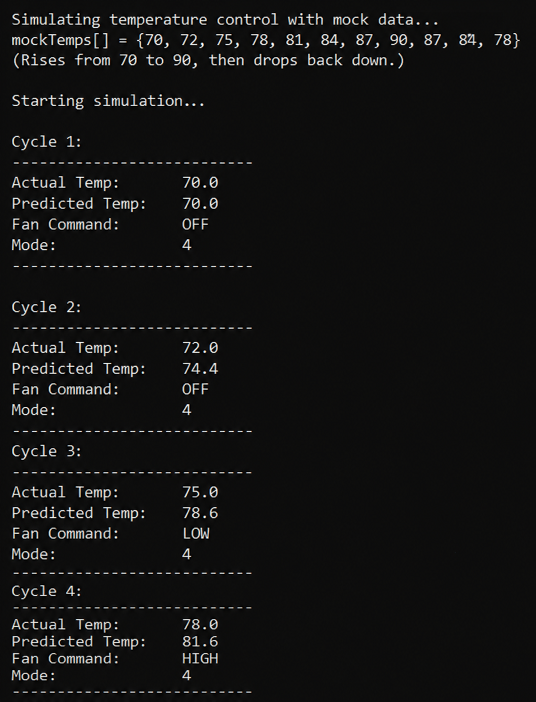
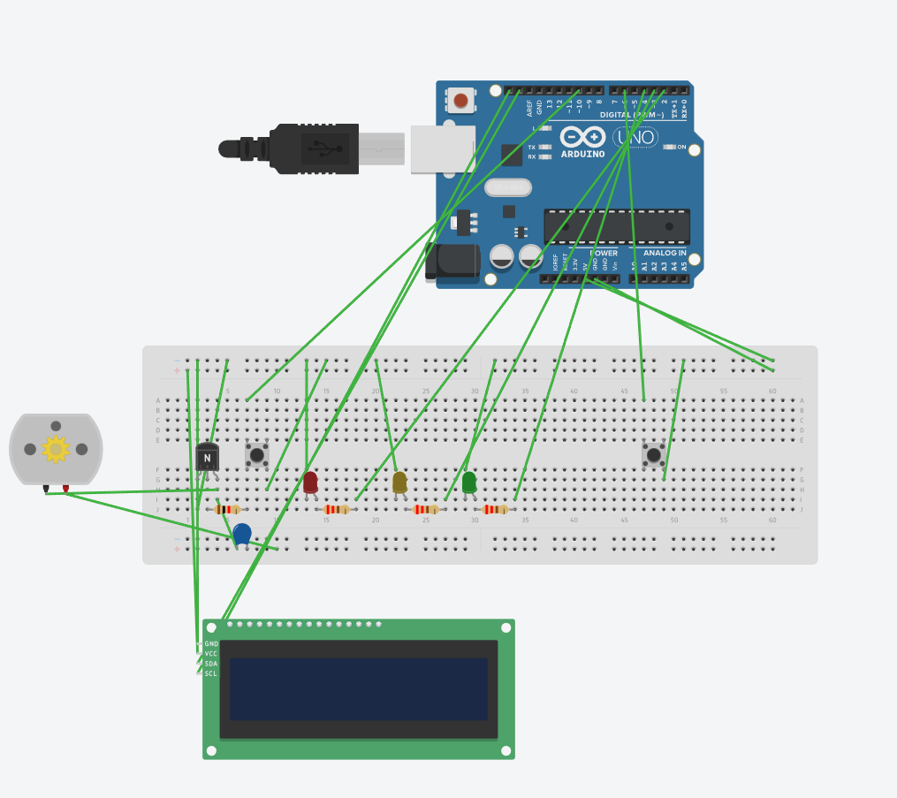
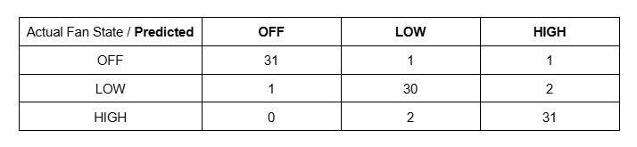

# AI Temperature Controlled Fan

An Arduino-based smart fan system that uses a Python AI model to predict temperature trends and automatically adjust fan speed before thresholds are reached. Built as part of EECE 471 – AI Applications at Manhattan University.

> **Course:** EECE 471 – AI Applications | Manhattan University
> **Team:** Myron Corpuz, Christian Hernandez, Justin Hungreder, Michael Mastrogiacomo
> **Advisor:** Dr. Wafa Elmannai

---

## Problem Statement
Current fan systems cannot automatically adjust to changing temperatures, leading to poor comfort control and wasted energy. This project integrates a trend-based AI model with an Arduino fan system to predict temperature changes and respond proactively rather than reactively.

---

## How It Works

The system runs in 4 switchable modes:

| Mode | Description |
|---|---|
| 1 – Sensor | Fan controlled by live DHT11 temperature readings |
| 2 – Mock | Fan controlled by simulated temperature sequence |
| 3 – AI (Sensor) | Python AI predicts next temp using live sensor data, controls fan |
| 4 – AI (Mock) | Python AI predicts next temp using mock data, controls fan |

**Serial Link:** Arduino sends mode and temperature to Python. Python returns fan command (OFF / LOW / HIGH).

**AI Model:** Trend-based predictor using recent ΔT to estimate next temperature. Extrapolates 120% of the current temperature change to get ahead of rising or falling trends.

**Agent Type:** Goal-based (maintain safe temperature) + utility-based (choose optimal fan level).

**Fan Control Thresholds:**
| Predicted Temp | Fan State | LED |
|---|---|---|
| Below 75°F | OFF | Red |
| 75°F – 85°F | LOW | Green |
| Above 85°F | HIGH | Yellow |

---

## Demo
[Watch Demo](your-youtube-link-here)

---

## Sample Output

---

## Circuit Diagram

---

## Components & Wiring

**Hardware**
- Arduino Uno
- DHT11 Temperature & Humidity Sensor
- 16x2 I2C LCD module
- DC Fan + Motor
- NPN Transistor
- 3x LEDs (Red, Yellow, Green)
- Touch sensor
- Pushbutton
- Capacitor & Resistors
- Breadboard & Jumper Wires

**Pin Assignments**
| Component | Arduino Pin |
|---|---|
| DHT11 Sensor | D7 |
| Fan (PWM) | D8 |
| LED Green | D2 |
| LED Yellow | D3 |
| LED Red | D4 |
| Touch Sensor | D6 |
| Reverse Button | D10 |
| I2C LCD SDA | A4 |
| I2C LCD SCL | A5 |

---

## Results

- System ran stable across ~99 test cycles (33 per fan state, 2.5s each)
- AI mode responds earlier than standard threshold control
- Mock mode successfully simulated rising and peaking temperatures
- Serial communication remained reliable throughout testing
- AI prediction achieved ~92% overall accuracy

### Confusion Matrix

### Accuracy by Fan State
| Fan State | Accuracy |
|---|---|
| OFF | 94% |
| LOW | 91% |
| HIGH | 94% |
| **Total** | **92%** |

---

## Discussion
The AI model predicts temperature changes ahead of time rather than reacting only to crossed thresholds. This produced smoother fan speed behavior and reduced sudden speed changes. Mock mode allowed safe testing of rising and peaking temperature scenarios without relying on real environmental conditions.

---

## Conclusion
- AI enhanced fan control outperforms basic threshold-based systems
- Proactive prediction reduces unnecessary fan state changes
- With better sensors, more training data, or a stronger model, accuracy could be improved further
- Demonstrates a practical application of AI in embedded systems

---

## Future Work
- Integrate a more advanced ML model (e.g. LSTM) for better prediction accuracy
- Add data logging to CSV for post-session analysis
- Port to ESP32 for wireless temperature monitoring
- Expand fan control to more granular PWM levels beyond OFF/LOW/HIGH

---

## Libraries & Dependencies

**Arduino**
- `Wire.h` (built into Arduino IDE)
- `LiquidCrystal_I2C` — install via Arduino Library Manager
- `DHT` — install via Arduino Library Manager

**Python**
- `pyserial` — install via `pip install pyserial`

## Setup
1. Upload `fan_controller.ino` to Arduino Uno
2. Connect hardware per wiring table above
3. Run `ai_fan_controller.py` on your computer
4. Switch to Mode 3 or 4 using the touch sensor to activate AI control
